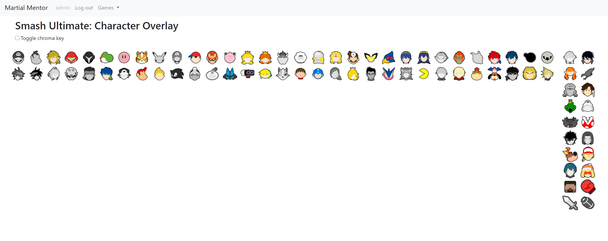
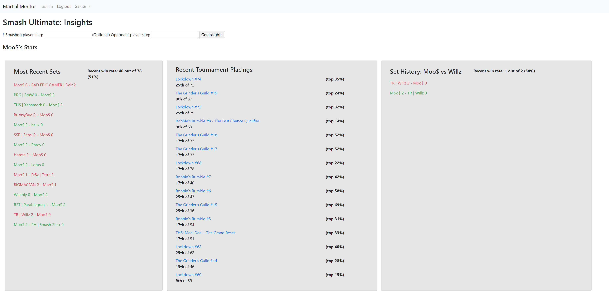

# Martial Mentor
Welcome to Martial Mentor, a web app created for fighting game players to offer tools and insights surrounding the games they play.

## Features
### Elite Smash Character Overlay


Although this site is designed to cater to players of any 1-on-1 fighting game, this feature is based around 
Super Smash Bros. Ultimate, which contains an online mode where characters obtain the coveted Elite Smash status when
the player wins enough matches online using that character.

A page containing the icons of all characters in the game can be viewed, and by default all characters are greyscale,
showing that none of them are in Elite Smash. If a character icon is clicked, their Elite Smash status is toggled,
and the icon is displayed in full colour. The status of your characters are saved in the database, and associated with your account.

This page can be used for reference when not playing the game, and can also be used as a livestream overlay.
A chroma key background can be toggled, so that the character icons can be displayed helpfully around the border of your stream!

### Insights Using smash.gg


The eSports tournament bracket website smash.gg is now used for many different games, meaning that insights using
tournament data can be obtained for more games than ever before!

This feature is still in progress, but it should be possible in future to view stats such as latest tournament sets,
placements and set history against specific players.

## Setup
### Required Packages (from pip)
- **python-dotenv** - For retrieving environment variables from file
- **smashggAPI** - Obtain tournament data from the Smash.gg site
- **sgqlc** - Simple GraphQL Client, which the smashggAPI package uses for data requests and results

### Environment Details
- This project was developed on django version 2.2.5, using Python 3.7.

**Database Setup:**
- Create a database in your chosen database framework (I personally used PostgreSQL locally and MySQL in production)
- In ```settings.py```, change details in the ```DATABASES``` section to match the match the database you just created.

**Smashgg Integration:**
- For Smash.gg features, obtain an API key from the site by clicking your profile in the bottom left, then Developer Settings, then Create new token.
- Next create a file named ```.env``` in the location ```martialmentor/.env```.
- In this file, type ```SMASHGG_API_KEY=enteryourapikeyhere```, pasting in the API key you just obtained.

**When in production:**
- Rename the ```martialmentor/settings_prod.py``` file to ```settings.py```.
- Create a text file containing the secret key and nothing else
- Edit the file path on line 25 in the renamed settings.py - ```with open('/home/MateoElGoron/secret_key.txt') as f:``` - to point to this file.
- Edit the database details in ```settings.py``` as above to match your database